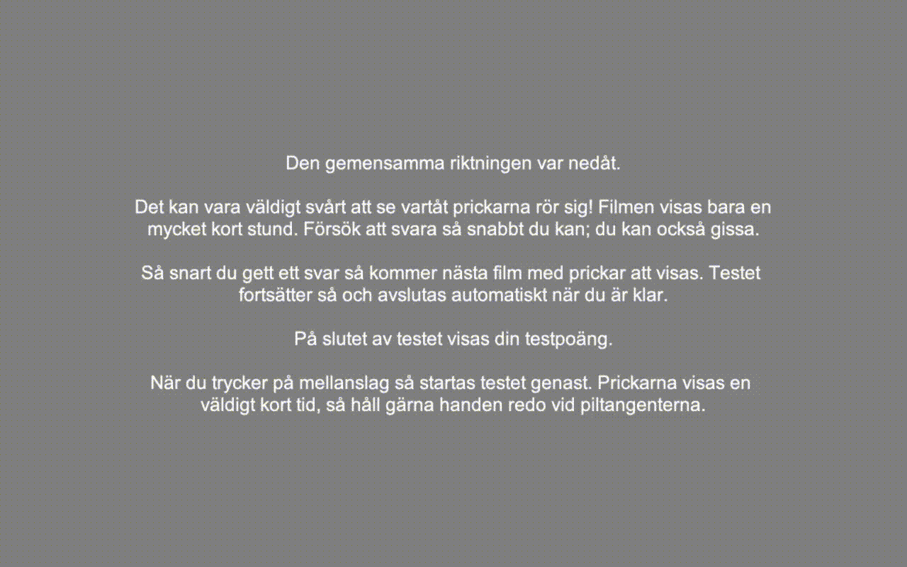

# PsychoPy Experiment: Motion Coherence / Random Dot Kinematogram Task
This is a project which implements a [Random Dot Kinematogram](http://lcni-3.uoregon.edu/phenowiki/index.php/Random-dot_Kinematograms) task in [PsychoPy](https://psychopy.org/), using PsychoPy's 'standalone' version Builder tool. The task instructions are in Swedish, but this can be modified (see below). 

Note that __this project only works when running the experiment locally with Python__. It has __not__ been implemented as an online task using PsychoPy's JavaScript library/transpiler and there are no plans for this, but you are welcome to try if you want.

## Getting started
Download PsychoPy from the official site, install, and launch. Open up the '.psyexp' file in this folder, using the 'Builder view' in PsychoPy. 

## Things you will want to change
As with all PsychoPy experiments, you should feed PsychoPy your monitor specifications and ask PsychoPy to use them in the 'Experiment Settings'->'Screen' section. You will also want to change the instructions if running the experiment with non-Swedish participants. Through the Builder view, go through the routines and update the text in the text components (eg 'welcome_text' in the 'instructions_screen_1' routine). Using eg Google Translate to aid in this process is recommended.

You might also want to modify things like the task's staircase parameters, which are found primarily by clicking the 'trial_loop' and 'run_loop' icons in the Builder view's 'routine flow' section. 

## Acknowledgements
This task was developed at Karolinska Institutet (KIND) as part of research led by Janina Neufeld, and was mostly based on a previous task described in this article:
Burghoorn, Floor, Mark Dingemanse, Rob van Lier, and Tessa M. van Leeuwen. “The Relation Between Autistic Traits, the Degree of Synaesthesia, and Local/Global Visual Perception.” Journal of Autism and Developmental Disorders 50, no. 1 (January 1, 2020): 12–29. https://doi.org/10.1007/s10803-019-04222-7.

An example of Tessa van Leeuwen & co's previous task can be found [here](https://www.socsci.ru.nl/wilberth/stimuli/stairHandlerForm.html). van Leeuwen provided valuable feedback and input during the development process. 

## Referencing this task
If you use this task in your research, please shortly acknowledge this somewhere in related articles with a text like "The task used in this study was based on a PsychoPy task developed by Lowe Wilsson at Karolinska Institutet as part of Janina Neufeld's research, with support from Tessa van Leeuwen.". To make it easier for other researchers to find the task, it would be best if you could somehow include a link (eg in an 'additional material' section) to this github repository, but if journal routines prohibit this then just an acknowledgement similar to the above will do.

## Feedback
If you notice any errors or want to suggest improvements then please either start an issue or a pull request (PR) here on Github, or contact me at datalowe@posteo.de.
